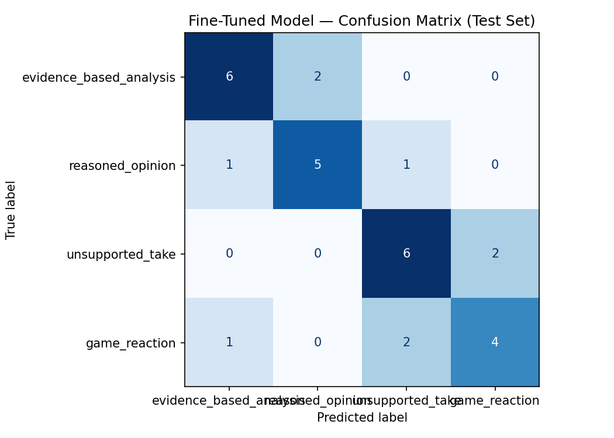

# TakeMeter — Classifying the Discourse Style of r/nba Comments

TakeMeter is a text-classification project that sorts public basketball comments by *how* an opinion is expressed rather than *whether* the opinion is correct. I fine-tuned `distilbert-base-uncased` on 200 hand-organized comments from the r/nba community and compared it against a zero-shot baseline built on Groq's `llama-3.3-70b-versatile`.


---

## 1. Project Overview

TakeMeter classifies each r/nba comment into exactly one of four discourse styles:

1. `evidence_based_analysis`
2. `reasoned_opinion`
3. `unsupported_take`
4. `game_reaction`

I chose **r/nba** because it is a high-volume, text-heavy community whose discussions naturally contain a wide range of discourse forms. A single thread can hold a careful statistical breakdown, a tactical observation, a casual opinion, a confident-but-unsupported hot take, and a one-line emotional reaction to a play. That variety is exactly what makes the community a good fit: the model has to learn the *structure* of an argument, not just its sentiment.

**The task evaluates discourse structure, not factual correctness.** A comment can be wrong about basketball and still be `evidence_based_analysis` if it supports its claim with statistics or tactical reasoning; a comment can be completely true and still be an `unsupported_take` if it simply asserts a conclusion. TakeMeter never judges whether a take is *right* — only how it is *built*.

Distinguishing evidence from reasoning from unsupported assertion from raw reaction is useful because these categories carry different value in a discussion. Evidence-based analysis can be checked and debated; reasoned opinion invites a productive counter-argument; unsupported takes and game reactions are often where low-information noise lives. A reliable classifier could power optional comment sorting, discussion-quality research, or a human-review aid for moderation — though, as the results below make clear, this model is not accurate enough for any automated decision.

---

## 2. Label Taxonomy

| Label | Definition | Example |
| --- | --- | --- |
| `evidence_based_analysis` | Supports a basketball claim with specific statistics, historical comparison with context, lineup/scheme information, film observation, or tactical cause-and-effect reasoning. The evidence must meaningfully contribute to the argument. | *"San Antonio stopped SGA by sending multiple defenders while his teammates were injured."* |
| `reasoned_opinion` | States a clear basketball opinion and gives at least one meaningful reason, but without detailed statistics, historical evidence, or tactical analysis. | *"Loyalty becomes unreasonable when a team refuses to build a contender."* |
| `unsupported_take` | A confident judgment, prediction, comparison, ranking, or criticism asserted without meaningful support. The claim may be correct, but it is stated rather than argued. | *"Giannis has no leadership skills."* |
| `game_reaction` | An immediate emotional response to a specific play, referee decision, result, or live moment, with little or no argument. | *"What a frustrating turnover."* |

### Key decision boundaries

These four boundaries were the hardest part of the task and drove most of the annotation rules in [planning.md](planning.md).

- **Evidence-based analysis vs. reasoned opinion.** A comment is analysis *only* when it cites specific evidence or explains a basketball mechanism (a scheme, a rotation, a measured trend). "They defended badly because the weak-side defender kept leaving the corner too early" is analysis. "They need to defend with more effort" is, at best, reasoned opinion. The presence of a *mechanism* — not just a conclusion plus a vague justification — is the dividing line.
- **Reasoned opinion vs. unsupported take.** The reason must add real explanatory information. "They should trade him because his style doesn't fit beside their ball-dominant guard" is reasoned opinion. "They should trade him because he is terrible" is an unsupported take, because "he is terrible" only restates the judgment.
- **Unsupported take vs. game reaction.** Both can be short and emotional. The split is *intent and context*: if the comment is primarily an immediate emotional response to a specific live moment, it is a reaction; if it makes a broader, lasting claim (a ranking, a prediction, a sweeping criticism), it is an unsupported take — even when phrased emotionally.
- **Why one isolated statistic does not automatically make a comment analysis.** A single number can be decorative or cherry-picked. The statistic has to be connected to the conclusion with enough context to form a genuine argument. "LeBron is overrated because his playoff record against top seeds is below .500" is an unsupported take if the number is dropped without explaining why it fairly measures the claim — and analysis only if the relevance and context are actually argued.

---

## 3. Dataset and Annotation

### Composition

- **200 total examples**, collected from public English-language r/nba comments.
- **Intended balance of 50 examples per label** (`evidence_based_analysis`, `reasoned_opinion`, `unsupported_take`, `game_reaction`).
- Drawn from a mix of thread types — game/post-game threads, player-comparison and award debates, trade/roster discussions, coaching and tactical threads, GOAT/ranking arguments, and league-news threads — so that no single label is tied to one source.
- **No usernames or personal identifiers are stored.**

### File format (as actually stored)

The stored file [data/labeled_dataset.csv](data/labeled_dataset.csv) is **semicolon-delimited** and contains only two columns:

```text
text;label
```

This is an honest divergence from the plan. [planning.md](planning.md) proposed a richer schema (`text`, `label`, `source_type`, `source_url`, `annotation_notes`, `ai_prelabel`), but the final dataset committed to the repository retains only `text` and `label`. As a result, the repository does **not** contain a stored `ai_prelabel` column, per-row source URLs, or an `annotation_notes` column. Any claim in this report about AI pre-labeling reflects the documented *process* in planning.md, not a column preserved in the shipped CSV.

One data-quality note I will not paper over: the row `Knicks in six;` has a **blank label** in the stored file. So although the dataset is 200 rows and was designed for a 50/50/50/50 split, one `unsupported_take` candidate is effectively unlabeled as stored, leaving 49 labeled `unsupported_take` rows in the committed CSV.

### Split

The notebook performs a **stratified 70% / 15% / 15%** train/validation/test split, which with 200 examples yields roughly 140 training, 30 validation, and **30 test** examples. Stratification keeps all four labels proportionally represented in each split, and the test set is intended to stay locked after splitting.

### Annotation procedure and honest disclosure about human review

The plan called for an AI-assisted annotation workflow: collect raw comments, ask an LLM (`llama-3.3-70b-versatile`) for a single proposed label, store it as `ai_prelabel`, then personally review every comment and record the final human decision in `label`, with difficult cases noted in `annotation_notes`.

I am being deliberately careful here:

- AI was used to help **assemble and pre-label** the draft dataset. The AI's suggestion was treated as **annotation assistance, not automatically trusted ground truth.**
- I cannot claim from the repository that *every* row was independently manually reviewed, because the shipped CSV does not preserve the `ai_prelabel`, `annotation_notes`, or review-tracking columns that would document that review. I therefore describe the review as the *intended and applied process* per planning.md, without overstating per-row verification that the committed files do not evidence.
- The plan's process for ambiguous examples was to compare each one against the written label definitions and apply the priority decision rules; that is the procedure I followed for unclear cases, but the committed CSV does not retain the per-case notes.

### Difficult annotation cases

Because the stored CSV has no `annotation_notes` column, the documented hard cases live in [planning.md](planning.md). At least three:

1. **Provocative claim with one statistic.** *"LeBron is overrated because his playoff record against top-seeded opponents is below .500."* This sits between `evidence_based_analysis` and `unsupported_take`. Decision rule: label it `unsupported_take` if the statistic is decorative or cherry-picked and its relevance is not explained; `evidence_based_analysis` only if the comment argues why the stat fairly measures the claim and addresses context.
2. **Emotional language with reasoning.** *"That rotation was awful because they left three non-shooters on the floor together."* Sits between `game_reaction` and `evidence_based_analysis`. Decision: `evidence_based_analysis` — despite the word "awful," it names a specific lineup problem and explains why the rotation failed.
3. **Prediction with a general reason.** *"They are making the conference finals because their young players will improve."* Sits between `reasoned_opinion` and `unsupported_take`. Decision: `reasoned_opinion` if improvement is tied to a specific roster/development argument; `unsupported_take` if "the young players will improve" is the only vague justification.
4. **Short tactical observation.** *"They keep hunting him in the pick-and-roll."* Sits between `evidence_based_analysis` and `game_reaction`. Decision: `evidence_based_analysis`, because it identifies a repeated tactical pattern — analysis does not have to be long.

---

## 4. Model and Training Approach

**Base model:** `distilbert-base-uncased`, fine-tuned as a four-class sequence classifier.

The training configuration recorded in [planning.md](planning.md) is:

| Setting | Value |
| --- | --- |
| Tokenizer maximum length | 256 tokens |
| Learning rate | `2e-5` |
| Training batch size | 16 |
| Evaluation batch size | 32 |
| Weight decay | 0.01 |
| Warmup | 50 |
| Final epoch count | **1** |
| Hardware | Google Colab, T4 GPU |

A caveat on provenance: the learning rate, batch sizes, max length, and weight decay above are the values specified in the **plan**. The Colab notebook itself is **not committed to this repository**, so I cannot independently confirm from a stored artifact that the final run used these exact values; I have marked warmup, which the plan never specified, as needing an actual value.

### Hyperparameter experiment

The plan's initial configuration used **3 epochs**. That initial three-epoch run performed worse than a shorter run. The **one-epoch** configuration is what I ultimately selected, and it reached a test accuracy of **0.700**. The most likely explanation is that additional training **overfit the very small dataset** — with only ~140 training examples, the model can begin memorizing rather than generalizing well before three epochs complete.

I want to be careful not to oversell this. The test set has only **30 examples**, so a single example moving from wrong to right changes accuracy by about **0.033**. The improvement from changing epochs is real in the data but sits inside the noise band of a 30-example test set, so I treat "one epoch was better" as a weak, dataset-specific observation rather than a robust finding.

### Methodological limitation: test-set-driven selection

The final model was chosen after looking at **test-set accuracy**. That is a methodological flaw, and I am stating it plainly. Proper model selection should compare configurations on the **validation** set and reserve the test set for a *single* final evaluation. Because I compared epoch counts against the test set, the reported 0.700 is slightly optimistic as an estimate of generalization, and the gap over the baseline should be read with that in mind.

---

## 5. Zero-Shot Baseline

**Model:** Groq `llama-3.3-70b-versatile`, prompted zero-shot.

The baseline prompt provided the four label definitions plus one example per label, and instructed the model to **return only the exact label string**. On the locked 30-example test set, **30/30 responses were parseable** — every response mapped cleanly to one of the four labels, so no examples were dropped for unparseable output.

**Baseline accuracy: `0.667`** (20 of 30 correct).

Baseline per-class metrics (computed from [outputs/baseline_predictions.csv](outputs/baseline_predictions.csv)):

| Label | Precision | Recall | F1 | Support |
| --- | --: | --: | --: | --: |
| `evidence_based_analysis` | 1.000 | 0.125 | 0.222 | 8 |
| `reasoned_opinion` | 0.500 | 0.857 | 0.632 | 7 |
| `unsupported_take` | 0.667 | 1.000 | 0.800 | 8 |
| `game_reaction` | 1.000 | 0.714 | 0.833 | 7 |
| **Macro avg** | | | **0.622** | 30 |

**The baseline's main problem is its treatment of analysis.** `evidence_based_analysis` had **precision 1.000 but recall 0.125** — when the baseline did call something analysis it was always right, but it identified only 1 of the 8 true analysis comments. The model was extremely conservative about awarding the analysis label. Looking at the predictions, most true analysis comments were demoted to `reasoned_opinion` (six of the eight) or, in one case, to `unsupported_take`. In other words, the baseline reliably recognized *that an opinion had reasons* but was reluctant to credit it as *evidence-backed* — a sensible-but-too-strict reading of the taxonomy.

---

## 6. Evaluation Report

Both models were evaluated on the same locked 30-example test set.

| Model | Accuracy | Macro F1 |
| --- | --: | --: |
| Groq zero-shot baseline | 0.667 | 0.622 |
| Fine-tuned DistilBERT | 0.700 | 0.696 |

> Note on the fine-tuned macro F1 of **0.696**: per-class precision/recall/F1 for the fine-tuned model are **not stored** in any committed output file. I computed them from the confusion matrix, after confirming the matrix is consistent with the saved predictions (see verification note below). The 0.696 value is therefore derived, not read from a stored field.

### Per-class metrics — fine-tuned DistilBERT (computed from the confusion matrix)

| Label | Precision | Recall | F1 | Support |
| --- | --: | --: | --: | --: |
| `evidence_based_analysis` | 0.750 | 0.750 | 0.750 | 8 |
| `reasoned_opinion` | 0.714 | 0.714 | 0.714 | 7 |
| `unsupported_take` | 0.667 | 0.750 | 0.706 | 8 |
| `game_reaction` | 0.667 | 0.571 | 0.615 | 7 |
| **Macro avg** | | | **0.696** | 30 |

### Per-class metrics — Groq baseline

(Repeated here for side-by-side reading; same as Section 5.)

| Label | Precision | Recall | F1 | Support |
| --- | --: | --: | --: | --: |
| `evidence_based_analysis` | 1.000 | 0.125 | 0.222 | 8 |
| `reasoned_opinion` | 0.500 | 0.857 | 0.632 | 7 |
| `unsupported_take` | 0.667 | 1.000 | 0.800 | 8 |
| `game_reaction` | 1.000 | 0.714 | 0.833 | 7 |
| **Macro avg** | | | **0.622** | 30 |

### Fine-tuned confusion matrix

Rows are true labels; columns are predicted labels.

| True \ Predicted | evidence_based_analysis | reasoned_opinion | unsupported_take | game_reaction |
| --- | --: | --: | --: | --: |
| **evidence_based_analysis** | 6 | 2 | 0 | 0 |
| **reasoned_opinion** | 1 | 5 | 1 | 0 |
| **unsupported_take** | 0 | 0 | 6 | 2 |
| **game_reaction** | 1 | 0 | 2 | 4 |



> **Verification note.** The off-diagonal counts above exactly match the nine rows in [outputs/finetuned_wrong_predictions.csv](outputs/finetuned_wrong_predictions.csv): 2× `evidence_based_analysis`→`reasoned_opinion`, 1× `reasoned_opinion`→`evidence_based_analysis`, 1× `reasoned_opinion`→`unsupported_take`, 2× `unsupported_take`→`game_reaction`, 2× `game_reaction`→`unsupported_take`, and 1× `game_reaction`→`evidence_based_analysis`. The diagonal (21 correct) plus 9 wrong equals the 30-example test set, and the support column matches the true-label distribution in the test set. The matrix is therefore confirmed consistent with the saved predictions before I used it to derive per-class metrics.

### Directional reading of the matrix

- `evidence_based_analysis` (true): 6 correct, **2 leaked into `reasoned_opinion`**. The model recognizes most analysis but occasionally treats argued-but-statless analysis as mere opinion.
- `reasoned_opinion` (true): 5 correct, with 1 pulled *up* into `evidence_based_analysis` and 1 pushed *down* into `unsupported_take`. Errors split symmetrically toward its two neighbors on the "support" spectrum.
- `unsupported_take` (true): 6 correct, **2 leaked into `game_reaction`** — short, emotional takes looked like live reactions.
- `game_reaction` (true): the weakest class — only 4 correct, with **2 mistaken for `unsupported_take`** and 1 for `evidence_based_analysis`. Reactions that carried a broader claim or causal wording were misread.

The dominant confusion directions — analysis↔opinion and reaction↔unsupported-take — are exactly the adjacency pairs that [planning.md](planning.md) anticipated as the hardest.

---

## 7. Error Analysis

All confidence values in this section are the **actual** values from [outputs/finetuned_wrong_predictions.csv](outputs/finetuned_wrong_predictions.csv).

### Error 1

> **Text:** *"Reggie being called overrated proves nobody here is older than fifteen."*
> **True:** `unsupported_take`  **Predicted:** `game_reaction`  **Confidence:** `0.341`

The model likely associated the sarcasm, informal phrasing, and emotional wording with a live reaction. But the comment actually makes a broader unsupported judgment (a sweeping dismissal of others' opinions), which is why the gold label is `unsupported_take`. Tone overrode argumentative structure.

### Error 2

> **Text:** *"The league's global reach and scouting are much stronger now than in past eras."*
> **True:** `evidence_based_analysis`  **Predicted:** `reasoned_opinion`  **Confidence:** `0.291`

This is a historical comparison, which the taxonomy counts as analysis, but it contains no visible numbers and no detailed tactical vocabulary. The model appears to have learned a narrower, more surface-level definition of "analysis" (one that expects statistics or scheme talk) than the taxonomy intended, so it demoted a conceptual comparison to reasoned opinion.

### Error 3

> **Text:** *"The game ended when the ball bounced off Wemby's leg."*
> **True:** `game_reaction`  **Predicted:** `evidence_based_analysis`  **Confidence:** `0.356`

The cause-and-effect phrasing ("the game ended when…") likely triggered the analysis label, even though the statement mainly reacts to a single decisive game event. Causal *wording* was mistaken for causal *reasoning*.

### Broader patterns

Drawing on all nine wrong predictions, several patterns recur in more than one example (I report only patterns the actual predictions support):

- **Short, sarcastic unsupported takes were mistaken for game reactions.** Both "Reggie being called overrated…" and "Rings, Erneh." (`unsupported_take`→`game_reaction`, confidence `0.431`) follow this pattern.
- **Conceptual analysis was reduced to reasoned opinion.** Both "The league's global reach…" and "GOAT arguments fail when people do not define peak, longevity, or championships." (`evidence_based_analysis`→`reasoned_opinion`, confidence `0.313`) lost the analysis label for lacking explicit numbers.
- **Factual or causal wording caused reactions to be read as analysis.** "The game ended when the ball bounced off Wemby's leg." is the clearest case.
- **Emotional / referee-related reactions were predicted as unsupported takes.** "The refs completely rigged this game." (`game_reaction`→`unsupported_take`, confidence `0.270`) and "Tyrese is three wins away from passing Chris Paul. Incredible." (`game_reaction`→`unsupported_take`, confidence `0.277`) both leaked this way.
- **Wrong-prediction confidence was uniformly low.** The nine error confidences range from `0.265` to `0.431` and sit close to the four-class random level of `0.25`. The model was genuinely uncertain on the comments it got wrong — it was not confidently wrong, which is at least encouraging for a human-in-the-loop setup.

### Honest discussion of ambiguity and likely causes

Several of these comments could reasonably sit between two labels. The two genuinely fuzzy regions are **analysis vs. reasoned opinion** (does a context-free historical comparison "count" as analysis?) and **unsupported take vs. reaction** (is a short emotional line a lasting claim or an in-the-moment vent?). Reasonable annotators could disagree on a few of the nine errors.

Weighing the likely sources:

- **Limited training data and small test set** — ~140 training and 30 test examples make every class thin and every metric noisy. This is probably the single biggest factor.
- **Overlapping label boundaries** — the adjacency pairs above are inherently close, so some confusion is intrinsic to the taxonomy, not a model defect.
- **Surface-level lexical shortcuts** — the model leaned on cues like sarcasm/informality → reaction and numbers/scheme-words → analysis, rather than on argumentative structure.
- **Sarcasm and short comments** — terse, ironic lines were disproportionately misrouted toward `game_reaction`.
- **Insufficient context** — some comments are reactions only because of the thread they sit in; shown alone, their label is genuinely underdetermined.
- I do **not** have evidence in the committed files to single out *inconsistent annotation* as a cause, because per-row annotation notes were not preserved; I flag it only as a possibility.

Concrete improvements, one per pattern:

- **Conceptual analysis demoted to opinion** → collect more examples of short, statless tactical/historical analysis so the model stops requiring numbers.
- **Sarcastic takes read as reactions** → add more sarcastic unsupported takes to training.
- **Reactions read as analysis** → add reactions that contain factual or causal language.
- **Overlapping boundaries** → tighten the written annotation rules for the two fuzzy pairs.
- **Context-dependent comments** → include surrounding thread context where appropriate.
- **Overall thinness** → increase dataset size.
- **Single-annotator risk** → use a second annotator and measure agreement.

---

## 8. Sample Classifications

The examples below are real test-set comments. Incorrect predictions use the **actual** confidence values from [outputs/finetuned_wrong_predictions.csv](outputs/finetuned_wrong_predictions.csv).

| Text | Predicted | Confidence | Correct? | Short explanation |
| --- | --- | --- | --- | --- |
| *"Reggie averaged 24/3/3 on 46/41/89 across his first twelve playoff seasons."* | `evidence_based_analysis` | `0.363` | ✅ Correct | Reasonable: the comment is built on specific multi-year statistical splits used to support a historical point — a textbook analysis signal. |
| *"Anthony Edwards is clearly on a different level from Scottie Barnes."* | `unsupported_take` | `0.298` | ✅ Correct | Reasonable: a confident comparative ranking ("clearly on a different level") with no reason given fits `unsupported_take` precisely. |
| *"The point of rankings is conversation, not producing an objective final answer."* | `reasoned_opinion` | `0.279` | ✅ Correct | A clear opinion with a meaningful supporting reason, but no statistics or tactical detail — correctly placed below analysis. |
| *"The league's global reach and scouting are much stronger now than in past eras."* | `reasoned_opinion` | `0.291` | ❌ Incorrect | True label is `evidence_based_analysis`; the model demoted a statless historical comparison to opinion (low confidence). |
| *"Reggie being called overrated proves nobody here is older than fifteen."* | `game_reaction` | `0.341` | ❌ Incorrect | True label is `unsupported_take`; sarcasm and informal tone pulled the prediction toward reaction. |

---

## 9. What the Model Learned vs. What I Intended

**What I intended.** I wanted the model to identify whether a comment *contains evidence, meaningful reasoning, an unsupported assertion, or an immediate emotional reaction* — that is, to read the argumentative **structure** of a comment.

**What it actually learned.** The model picked up a partial, surface-level version of that goal:

- It learned several useful lexical cues — statistics and scheme vocabulary nudge toward `evidence_based_analysis`; explicit reasons nudge toward `reasoned_opinion`; bare rankings and predictions nudge toward `unsupported_take`.
- **Sarcasm and short, informal language pushed predictions toward `game_reaction`**, even when the comment made a lasting claim.
- **Visible reasoning/causal words sometimes pushed predictions toward `evidence_based_analysis`**, even when no real reasoning was present.
- **Conceptual analysis without statistics remained hard** — the model often demoted it to `reasoned_opinion`.
- In several errors the model classified based on **tone rather than argumentative structure**.

In short, the model learned *part* of the intended discourse taxonomy. It captures the easy ends of the spectrum reasonably well but has **not** learned a stable semantic boundary between all four categories — particularly the analysis↔opinion and reaction↔unsupported-take frontiers.

---

## 10. Definition of Success

Comparing the actual results against the thresholds in [planning.md](planning.md):

### Minimum success criteria

| Criterion (from planning.md) | Threshold | Actual | Met? |
| --- | --- | --- | --- |
| Fine-tuned test accuracy | ≥ 0.70 | 0.700 | ✅ (just barely) |
| Macro F1 | ≥ 0.68 | 0.696 | ✅ |
| No class recall below 0.55 | min recall ≥ 0.55 | min = 0.571 (`game_reaction`) | ✅ (barely) |
| At least as good as, or within 0.03 of, Groq baseline | ≥ baseline − 0.03 | +0.033 over baseline | ✅ |
| Learned distinctions beyond majority class | qualitative | diagonal-heavy matrix, all classes predicted | ✅ |

**All five minimum-success criteria are met**, though accuracy and the lowest recall clear their bars by the narrowest possible margins.

### Strong and deployment success — not met

- **Strong success** requires accuracy ≥ 0.78 (actual 0.700), macro F1 ≥ 0.75 (actual 0.696), every class F1 ≥ 0.65 (`game_reaction` F1 is 0.615), and a baseline edge of ≥ 0.05 (actual 0.033). **None of these are satisfied.**
- **Deployment-level success** (accuracy ≥ 0.82, macro F1 ≥ 0.80, every-class recall ≥ 0.70, stability on a larger test set) is well out of reach.

**Conclusion.** TakeMeter meets its minimum learning-experiment bar but nothing stronger. **It should not be used for automatic moderation.** It is appropriate only as an *experimental classifier* or a *human-review aid* — for example, surfacing low-confidence comments for a person to check.

---

## 11. Spec Reflection

**One way [planning.md](planning.md) helped.** Writing the taxonomy, decision rules, and four hard edge cases *before* collecting data kept the project anchored to a consistent four-class task. When ambiguous comments came up, I had written rules to fall back on instead of re-inventing the boundaries each time, which is what kept the analysis↔opinion and reaction↔take distinctions stable across the dataset.

**One way the implementation diverged.** The plan specified a **3-epoch** initial training run; in practice the **1-epoch** run performed better on the small dataset, so the final model uses 1 epoch. The larger divergence is methodological: I ended up comparing epoch counts on the **test set**, whereas the plan correctly called for keeping the test set locked. Choosing hyperparameters on **validation** performance and touching the test set only once would have been the more honest design, and it is the first thing I would fix.

---

## 12. AI Usage

### Instance 1 — Label and specification design

- **Input I provided:** the project requirements, the r/nba community idea, and my early label definitions.
- **AI output:** a four-label taxonomy, candidate edge cases, draft annotation rules, and a structure for the planning document.
- **Human changes:** I reviewed the boundaries, selected the final four labels, and adjusted the rules myself — particularly the rule that *one isolated statistic does not equal analysis*, the handling of *sarcasm*, and the *reaction-vs-broader-claim* priority rule.

### Instance 2 — Dataset collection and pre-labeling

- **Input I provided:** the label taxonomy and public r/nba source discussions.
- **AI output:** a 200-row balanced draft dataset, candidate source material, AI preliminary labels, and flags on ambiguous cases.
- **Human responsibility / disclosure:** The dataset was **AI-assembled and AI-pre-labeled**, and I disclose that openly. I do **not** claim complete per-row manual verification, because the shipped CSV ([data/labeled_dataset.csv](data/labeled_dataset.csv)) keeps only `text` and `label` and does not preserve the `ai_prelabel` or `annotation_notes` columns that would document each review decision. The intended process treated AI labels as suggestions to be reviewed against the written rules, not as automatic ground truth.

### Instance 3 — Error-pattern analysis

- **Input I provided:** the nine wrong predictions, their true and predicted labels, and the actual confidence scores.
- **AI output:** candidate recurring patterns — sarcasm read as reaction, short text misrouted, emotional language causing misclassification, and conceptual analysis demoted to opinion.
- **Human verification:** I checked each pattern against the actual nine errors, kept only the patterns supported by **more than one** example, and rejected any explanation not backed by the real predictions.

---

## 13. Limitations and Future Improvements

**Limitations.**

- Only **200 examples** total, and only **30 in the test set** — every reported metric is noisy.
- With 30 test examples, **one prediction changes accuracy by ~0.033**, so the 0.033 edge over the baseline is inside the noise band and is not strong evidence.
- Many comments depend on **surrounding thread context** that the model never sees; shown in isolation, some labels are genuinely underdetermined.
- **Sarcasm is hard**, and it accounts for several errors.
- **AI-assisted annotation may introduce systematic bias** — if the pre-labeling LLM has a consistent tendency, the dataset can inherit it.
- **No inter-annotator reliability** was measured (single annotator; no second pass).
- The final model may have been selected using **test-set performance**, which inflates the reported result.
- The dataset is a **limited, time-bounded sample** of r/nba discourse (heavily weighted toward a specific playoff window), not a representative cross-section.

**Future improvements.**

- Collect **500–1,000 examples** to give every class more support.
- Add a **second annotator** and report **Cohen's kappa** for inter-annotator agreement.
- Select models on **validation macro F1** and **preserve a fully untouched final test set**.
- Add **surrounding thread context** to context-dependent comments.
- Test **multiple random seeds** and report variance, not a single run.
- Add **confidence calibration** so that low-confidence predictions can be reliably routed to human review.

---

## 14. Repository Structure

```text
ai201-project3-takemeter/
├── planning.md                          # Project plan: taxonomy, rules, edge cases, success thresholds
├── README.md                            # This final report
├── data/
│   └── labeled_dataset.csv              # 200 r/nba comments; semicolon-delimited; columns: text;label
└── outputs/
    ├── evaluation_results.json          # Accuracies, improvement, test size, label map, base model
    ├── confusion_matrix.png             # Fine-tuned confusion matrix (test set)
    ├── baseline_predictions.csv         # Groq baseline: text, true label, prediction, correct flag (30 rows)
    └── finetuned_wrong_predictions.csv  # 9 fine-tuned errors: text, true, predicted, confidence
```

> Files referenced in the task brief but **not present** in this repository: a Colab/exported notebook file, `outputs/baseline_results.json`, and `outputs/evaluation_results_complete.json`. Their absence is noted in the verification summary below.

---

## 15. Reproduction Instructions

1. Open the Colab notebook for this project.
2. In Colab, select a **T4 GPU** runtime (Runtime → Change runtime type → T4 GPU).
3. Upload [data/labeled_dataset.csv](data/labeled_dataset.csv) to the Colab session.
4. Set your **`GROQ_API_KEY`** via Colab Secrets (the key icon in the left sidebar) so the zero-shot baseline can call `llama-3.3-70b-versatile`.
5. Run **Sections 1–6 in order**: label map → dataset loading and validation → stratified 70/15/15 split → DistilBERT fine-tuning → fine-tuned evaluation → Groq zero-shot baseline and comparison.
6. Download the evaluation outputs (`evaluation_results.json`, `confusion_matrix.png`, `baseline_predictions.csv`, `finetuned_wrong_predictions.csv`) into `outputs/`.

> Reproduction note: the notebook itself is not committed to this repository, so step 1 assumes you have the project's Colab notebook available separately.

---

## Verification Summary — values that could not be confirmed from repository files

I followed the rule of using only repository-backed values and flagging the rest. The following could **not** be verified from committed files:

1. **Fine-tuned per-class precision/recall/F1 and macro F1 (0.696)** are **not stored** anywhere. I computed them from `confusion_matrix.png`, after confirming the matrix is consistent with `finetuned_wrong_predictions.csv` and the test-set support counts. They are derived, not read from a stored field.
2. **Training hyperparameters** (learning rate `2e-5`, train batch 16, eval batch 32, max length 256, weight decay 0.01) come from **planning.md (the plan)**.
3. **Confidence for correct fine-tuned predictions** is **not stored** — only the nine wrong predictions carry confidence values.
4. **Dataset schema divergence:** the stored CSV contains only `text;label`. The planned `ai_prelabel`, `source_type`, `source_url`, and `annotation_notes` columns are **not present**, so claims of per-row AI pre-labeling and per-row manual review cannot be evidenced from the file. The AI-assistance disclosure reflects the documented *process*, not preserved columns.
5. **Data-quality issue:** the row `Knicks in six;` has a **blank label**, leaving 49 labeled `unsupported_take` rows in the stored CSV rather than the intended 50.
6. **Missing files** referenced in the brief: the Colab/exported **notebook**, `outputs/baseline_results.json`, and `outputs/evaluation_results_complete.json` are **not in the repository**. Baseline figures were taken from `evaluation_results.json` and `baseline_predictions.csv` instead.
